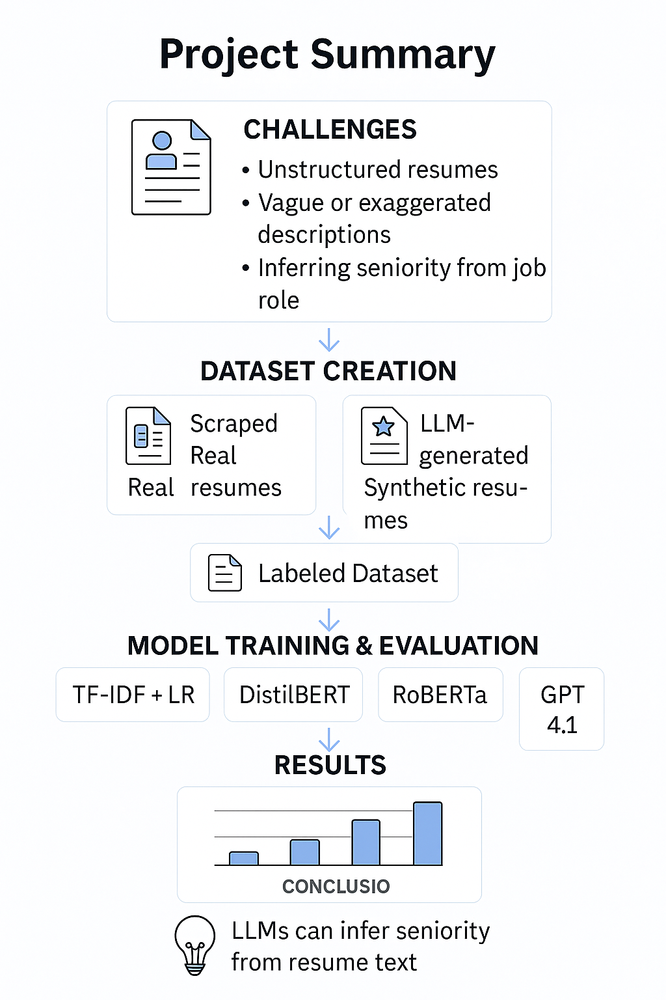

# Resume_Reveal

**Resume Seniority Classification**  
Predict seniority level from resume text and job role.


##  📖 Overview

Recruiters and HR systems often struggle to assess candidate seniority from free-form resumes and job descriptions, leading to slow and error-prone review processes.
ResumaAnalyzerNLP tackles this by automating seniority classification (Junior, Mid, Senior) based on the combined analysis of resume text and job title, using a hybrid NLP pipeline that integrates rule-based heuristics, deep learning, and GPT-4. We collect and label data accordingly, train models (TF-IDF, DistilBERT, RoBERTa), and evaluate GPT-4’s prompt-only performance—achieving up to 90.6% accuracy with RoBERTa.
The novelty of our approach lies in jointly leveraging structured (job title) and unstructured (resume) input, while combining fine-tuned transformer models, and zero-shot GPT-4 inference.

## 🎯 Project Goals
**-- Data Collection:** Extract and generate resume data with job roles and corresponding seniority levels.

**-- Data Annotation:** Label examples using both heuristics (job title patterns) and manual verification.

**-- Baseline Modeling:** Train a TF-IDF + Logistic Regression classifier.

**-- Transformer Fine-Tuning:** Fine-tune DistilBERT and RoBERTa for sequence classification.

**-- Zero-shot Inference:** Evaluate GPT-4 on prompt-based predictions without fine-tuning.

**-- Evaluation:** Measure performance across all models using accuracy, loss, and confusion matrices.

## 🧠 Used Models
## 1. Baseline:
     -- TF-IDF + Logistic Regression
## 2. Models & Inference:     
       -- DistilBERT
           Fine-tuned for 10 epochs. Best result at epoch 10.

       -- RoBERTa
           Fine-tuned for 8 epochs. Best performance across all models.

       -- GPT-4
          Prompt-only inference with zero-shot classification. Tested with template-based prompt structures.

## 📁 Dataset
**File: DATA.xlsx** - 

 -- Resume (free-text)
 
 -- Job Title
 
 -- Seniority Label (Junior, Mid, Senior)

**Sources:** - 

 -- Web scraping

 -- GPT-4 synthetic generation

 -- Manual filtering
 
##  📈 Results Summary

 | Model                        | Accuracy   | Best Epoch  | Validation Loss |
| ---------------------------- | ---------- | ----------- | --------------- |
| TF-IDF + Logistic Regression | 81.20%     | -           | -               |
| GPT-4 (prompt-only)          | 78.60%     | -           | -               |
| DistilBERT (fine-tuned)      | 87.18%     | Epoch 10    | 0.4026          |
| RoBERTa (fine-tuned)         | **90.60%** | **Epoch 8** | **0.3297**      |

##  📊 Graphical Abstract

   
   
## 📁 Repository Structure

```

├── Proposal/
│   ├── Nlp final project presentation.pdf
│   ├── Resume reveal - Reveal seniority level.pdf
│   └── Resume reveal FIRST_PROP_NLP.pdf
│
├── Results/
│   ├── Evaluation.csv
│   ├── FlowChart.png
│   ├── RoBERTa_training_results.csv
│   ├── distilBERT_training_results.csv
│   └── evaluation_file.pdf
│
├── SRC/
│   ├── DATA.xlsx
│   ├── DATA_GENERATION_AND_SCRAPING.ipynb
│   ├── EDA+BASELINE.ipynb
│   ├── MODELS_NOTEBOOK.ipynb
│   └── README.md  
```

##  ⚙️ Installation

1. **Clone this repository**  
   ```bash
   git clone https://github.com/matancohen1205/ResumaAnalyzerNLP.git
   cd ResumaAnalyzerNLP/SRC
   
📌 Note: For GPT-4 inference, register to [OpenRouter](https://openrouter.ai/settings/keys) and set your API key in the notebook.

## 🤝 Team Members
Matan Cohen

Eden Menahem

Shira Shani


